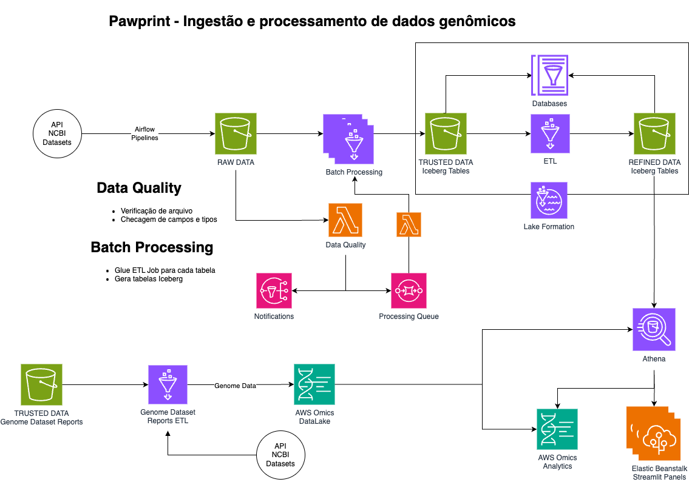

# Pawprint - Ingestão e processamento de dados genômicos na nuvem

## Introdução

O projeto visa criar uma estrutura automatizada de ingestão, organização e processamento
de dados genômicos em ambiente de nuvem (AWS) usando serviços gerenciados e código
customizado. 
O projeto está sendo desenvolvido como uma ideia de uma boa organização e estruturação
de projetos de Data Lake de propósito específico, que pode auxiliar startups ou grupos
de pesquisas na área de bioinformática a utilizarem a nuvem para processamento de dados
com custos reduzidos e escalabilidade.

## Fonte de dados

O projeto utiliza como fonte de dados, os dados de genoma do NCBI Datasets (https://www.ncbi.nlm.nih.gov/datasets/).
O NCBI Datasets é um serviço de dados genômicos que fornece acesso a dados de genoma de 
diversas espécies além de catalogar genomas de vírus e bactérias.
Esse projeto pode ser modificado para acessar qualquer base de genomas, desde que as 
fontes de dados, tabelas ingeridas e processos de ETL sejam modificados. Lembrando que,
por ser um Data Lake de propósito específico, tabelas e dados são criados de acordo com
a fonte de dados. Mas, a arquitetura e estrtura de ingestão podem ser modificados para qualquer
fonte de dados.

## Arquitetura

O projeto utiliza recursos da AWS para a criação de dois Data Lakes com conexão direta via motor SQL
e possibilidade de conexão com paineis de visualização de dados. A arquitetura é composta pelos
seguintes serviços:

- S3
- Glue ETL Jobs
- Glue Crawlers
- Glue Data Catalog
- Amazon Athena
- SQS / SNS
- Lambda
- Elastic Beanstalk para provimento de paineis com Streamlit



## Estrutura de diretórios

O projeto está estruturado da seguinte forma:

```
├── README.md                               <- Documentação do projeto
├── airflow                                 <- DAGs Airflow para ingestão da fonte de dados
├─────── config_files                       <- Arquivos de configuração para as pipelines de ingestão
├───────────── possible_taxons.json         <- Taxonomias selecionadas para ingestão
├── config                                  <- Arquivos de configuração do projeto
├─────── expectations                       <- Suites do great-expectations para as tabelas
├─────── config.json                        <- Arquivo de configuração para o Data Quality
├── docs                                    <- Arquivos de documentação
├── notebooks                               <- Notebooks para testes, experimentação e validação dos dados
├── src                                     <- Código fonte do projeto (Lambda, Glue, etc)
├─────── quality                            <- Código da Lambda do Data Quality (Docker)
├── terraform                               <- Arquivos terraform para provisionamento da infraestrutura
```

## Execução

- Para rodar o projeto, será necessário um ambiente Airflow com conexão com a AWS para ingestão
no S3.
- Para criar a estrutura, basta configurar o arquivo config.tfvars no diretório terraform com
os dados desejados (nomes de buckets, região, etc) e rodar o terraform.

## Arquivos de configuração

### Terraform
Para configurar os recursos AWS no Terraform, as seguintes configurações estão disponíveis:

- **region**: Região onde os recursos serão criados
- **resource_prefix**: Prefixo para o nome dos recursos a serem criados
- **account_id**: ID da conta AWS para a criação dos recursos
- **aws_resources_bucket**: Bucket para a cópia dos arquivos de configuração e scripts Glue
- **gx_path**: Caminho para os arquivos de suites do Great Expectations

### Airflow
O arquivo airflow/config_files/possible_taxons.json contém as taxonomias que serão ingeridas.
É possível incluir um ID de taxonomia do NCBI Datasets, nome científico e nome comum. As DAGs
de ingestão irão procurar por todos os nós filhos das taxonomias listadas e salvar apenas esses dados.

### Data Quality
O arquivo config/config.json contém as configurações para o Data Quality. É possível configurar
o nome da base e tabela (que serão usados para carregar a suite do GX) e se a tabela deve ser salva
no S3 com algum particionamento (data por exemplo)


